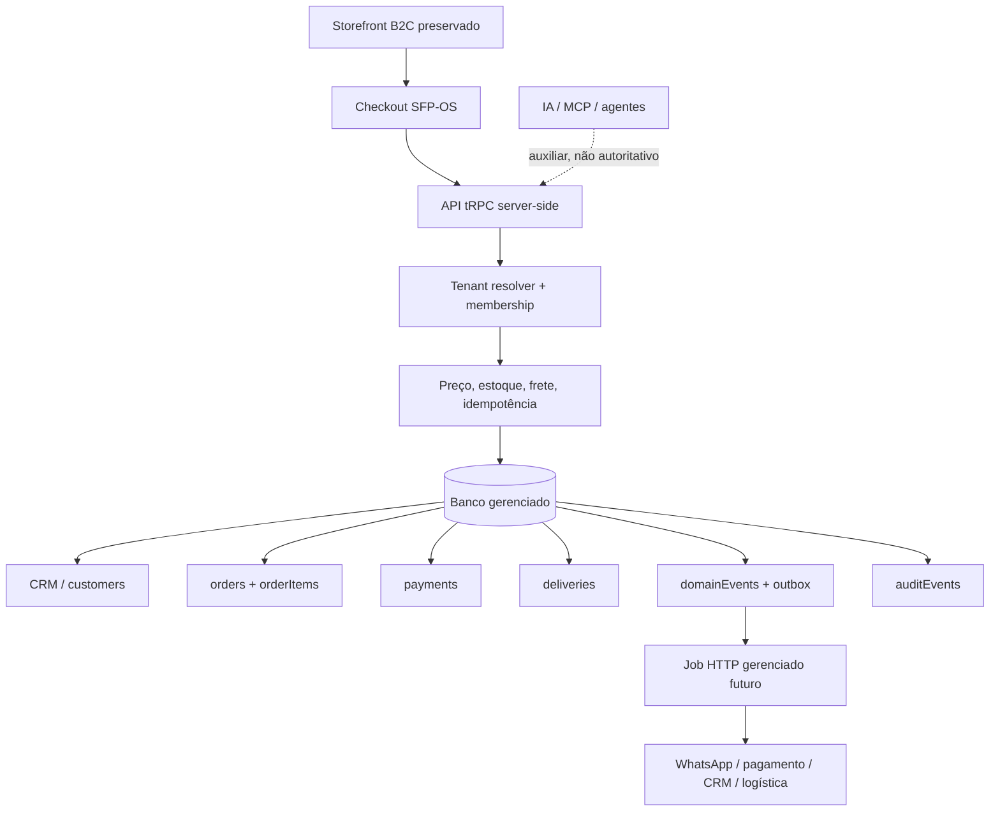

# Sea System ERP / SFP-OS — Master documentation

**Estado:** release candidate de preview, não produção comercial.  
**Case zero:** Seafoods Premium.  
**Produto futuro:** Sea System ERP reutilizável para B2C, B2B e serviços.  
**Storefront em uso:** preservado e não alterado.  
**Princípio:** ERP primeiro; banco como fonte de verdade; infraestrutura gerenciada e portável, sem VPS.

> O SFP-OS funciona em camadas. Banco, API, autenticação, regras, auditoria e eventos são o núcleo. IA, MCP, WhatsApp, marketing, logística e pagamentos são adapters auxiliares e não podem ser autoridade de preço, estoque, pedido, frete, margem, status ou dados privados.

## 1. Estado verificável

| Área | Situação | Evidência |
|---|---|---|
| Checkout `/checkout` | Funciona em demo seguro | Catálogo TESTE, etapas progressivas, frete a confirmar, desktop/mobile verificados |
| Commerce Core | Implementado | Pedidos, itens, clientes, pagamento, entrega, domínio, outbox, auditoria e idempotência |
| Tenant isolation | Implementado no núcleo | `tenants`, memberships, escopo server-side e filtros no Commerce Core |
| Dashboard/Control Tower | Funciona em demo; live condicionado a tenant/membership | Interface identifica Visão demonstrativa |
| Segurança HTTP | Implementada como baseline | CSP, headers, CORS allowlist e rate limit durável |
| Outbox serverless | Preparada, não conectada | Callback cron-only, processor deferido e sem side effect externo |
| WhatsApp Cloud API | Endpoint preparado, não conectado | Verify token, HMAC, deduplicação, inbox e notificações internas; sem app Meta/credenciais/envio |
| Analytics de vendas | Implementado, vazio sem dados comerciais | Filtros 7/14/30 dias, canal, status e valor mínimo; agregação server-side por tenant |
| Referência comercial V3 | Versionada, não publicada | Preços B2C/B2B, Boil, carrinho canônico e metas com status fornecido/não reconciliado |
| Política B2B Cabral | Implementada, bloqueada | Termos por pedido, +18%, desconto ≤10%, pacote 5–6 kg, comissão 2–5% e flag separada de aprovação |
| Control Tower de crescimento | Implementada como referência | Metas B2C/B2B, lucro e funil reverso; sem misturar alvo com realizado |
| Tenant staging Seafoods Premium | Criado e isolado | `seafoods-premium-staging` com o administrador atual como `owner`; persistência comercial desligada |
| Reconciliação de catálogo | Implementada, bloqueada | 151 referências RED tenant-scoped aguardam SKU, custo posto, estoque, lote, validade, foto, impostos, logística e evidência |
| Aquisição B2B | Playbook pronto, mídia não publicada | Meta, Google Search, outbound e Control Tower com gate de CAC versus contribuição |
| Domínio oficial | Preparado, não publicado | canonical, OG, robots, sitemap e runtime config |
| Staging técnico | Preparado, não publicado | canal explícito, noindex/no-store, CORS restrito, sitemap vazio e persistência bloqueada |
| Storefront Vercel | Preservado | Nenhuma alteração neste ciclo |

## 2. Arquitetura

Cada integração futura deve ficar atrás de adapter e secret management. Dados externos indisponíveis não podem apagar pedidos; o estado correto fica no banco e o outbox aguarda reprocessamento. O webhook WhatsApp implementado recebe somente oportunidades e atualiza inbox/notificações; preço, pedido, pagamento e receita continuam no Commerce Core. Não há processo persistente, timer em memória, VPS, PM2 ou worker manual.

O RBAC do tenant permite consultas ao papel `viewer` e reserva transições de pagamento, entrega e estoque a `owner`, `admin` ou `operator`. O processor de outbox possui claim condicional para evitar dupla entrega em serverless, assinatura HMAC, HTTPS, timeout, `Idempotency-Key`, backoff exponencial, auditoria e vínculo obrigatório entre `taskUid` e tenant. O provider, o job e os segredos continuam desligados até aprovação.

## 3. Fluxo comercial

O fluxo preparado é `tráfego → produto → carrinho → pedido → pagamento → entrega → CRM → recompra`. O checkout usa dados progressivos e confirma preço no backend. `ORDER`, `PAYMENT` e `DELIVERY` são estados separados. Sem cotação, frete é `NULL` e apresentado como `A confirmar`. Sem tenant configurado ou catálogo não-fictício, pedido é demo e não é persistido.

A Control Tower de crescimento usa as metas fornecidas de R$ 150 mil/mês B2C, R$ 500 mil/mês B2B e R$ 1 milhão/ano de lucro como referência de execução. Com ticket assumido de R$ 250 e conversão WhatsApp assumida de 5%, calcula 600 pedidos/mês, 20/dia e 12 mil interações qualificadas/mês. Esses números permanecem premissas até haver dados reais de campanha, pedido, margem, CAC e recompra.

O B2B futuro reutiliza o core com `prospecção → lead → qualificação → oportunidade → cotação → negociação → pedido → faturamento → recompra`. Billing SaaS, trial, planos e upgrade estão fora do caminho crítico e não foram implementados.

## 4. Dados e isolamento

O tenant configurado pelo runtime resolve a superfície pública. Dados privados exigem membership do usuário autenticado. Produtos, estoque, clientes, pedidos, pagamentos, entregas, eventos e auditoria carregam `tenantId`. Idempotência é única por tenant, escopo e chave. SKU é único por tenant. Linhas legadas continuam com `tenantId` nulo até ocorrer uma migração de dados autorizada.

O banco foi inspecionado e contém 22 tabelas. O único catálogo persistido é a fixture `TESTE-01` a `TESTE-09`, cujo total canônico de nove itens é R$ 1.828,54. Ela não representa preço, disponibilidade ou estoque comercial real. As tabelas `whatsappMessages` e `dashboardNotifications` recebem os eventos do endpoint quando futuramente ativado; `sales.orderId` impede duplicação de venda derivada de pagamento.

O tenant `seafoods-premium-staging` foi criado com o usuário administrador atual como `owner`. A persistência comercial permanece desativada. O intake de catálogo possui 151 itens com status `blocked` e semáforo `RED`: 17 B2C, 13 B2B e 121 documentais sem canal atribuído. Todos estão sem evidência completa de SKU, custo posto, estoque, lote, validade, foto, impostos, logística e aprovação. Essa fila é a única rota permitida antes de promover produtos para o catálogo operacional.

Para representação Cabral, `b2bCabralTerms` registra valor de tabela, acréscimo de 18%, desconto autorizado até 10%, preço final, margem adicional, comissão esperada/recebida, valor representado e pacote de 5–6 kg. Valor representado não é receita própria Seafoods. Pedidos Cabral requerem CNPJ e aprovação separada `APP_ALLOW_CABRAL_REPRESENTATION=true`, mantida bloqueada no staging.

## 5. Domínio e infraestrutura

O domínio planejado é `https://seafoodspremium.com.br/`. O projeto contém metadata canônica, Open Graph, robots, sitemap e configuração de origins/subdomínios planejados. O canal de staging usa `APP_RELEASE_CHANNEL=staging`, `APP_ALLOW_PERSISTENCE=false`, `X-Robots-Tag: noindex`, `Cache-Control: no-store`, canonical neutro atualizado no cliente e sitemap vazio. OAuth preserva `window.location.origin` para callback seguro. Não houve deploy de domínio customizado, TLS/DNS, redirect, Registro.br ou ativação de `pedidos`, `prontos`, `natura`, `boil` ou `b2b`.

A infraestrutura usa hosting, banco e autenticação gerenciados. O callback `/api/scheduled/outbox` só aceita identidade cron da plataforma. A criação de job requer release implantado, tenant configurado, adapter aprovado e autorização específica; nenhum cron está ativo neste estado de preview.

## 6. Validação

Foram aprovados `pnpm check`, `pnpm test` e `pnpm build`: doze arquivos de teste e trinta testes. A outbox foi coberta com provider fake plugável, claim concorrente, publicação, retry, falha terminal e auditoria; o WhatsApp foi coberto com HMAC, handshake gated e endpoint deferred; analytics foi coberto para não inventar dados sem tenant. Verificações HTTP confirmaram CSP/headers, `X-Robots-Tag` de staging, `Cache-Control: no-store`, `robots.txt` com `Disallow: /`, sitemap vazio, bloqueio 403 para callback cron e 503 para o webhook WhatsApp desligado. O build possui um aviso não bloqueante de chunk JavaScript acima de 500 kB, recomendado para um futuro code splitting.

## 7. Gates para ativar produção

O primeiro gate é catálogo real autorizado. Depois: criar tenant e membership reais, configurar segredo dos providers no runtime, publicar release candidate, validar OAuth/CORS/TLS/assets no host publicado, executar pedido real idempotente, testar pagamento/entrega, e provar backup, restore e rollback. A alteração de DNS depende de aprovação explícita após os gates técnicos.

Para B2B, R$ 5.000/dia com ticket assumido de R$ 1.250 exige quatro pedidos/dia. Com conversões assumidas de 30% de lead para cotação e 25% de cotação para pedido, o plano requer 54 leads/dia. Um CPL de R$ 35 implicaria R$ 1.890/dia de mídia e CAC de R$ 472,50 por pedido, 37,8% do ticket. O gasto de mídia permanece bloqueado até a margem de contribuição por pedido ser comprovada com custo, frete, impostos, perdas, taxa de pagamento e desconto.
